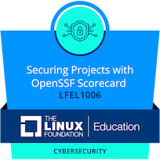

<!-- Profile README for bashSunny101 -->

<h1 align="center">Hi 👋, I'm Sunny Pal</h1>
<h3 align="center">A passionate learner, developer, and cybersecurity enthusiast</h3>

  

---

## 🚀 About Me

- 🧑‍💻 Developer | Open Source Contributor | Cybersecurity Enthusiast  
- 🌱 Lifelong learner exploring new technologies, tools, and frameworks  
- 👀 Interested in building practical projects with real-world impact  
- 📫 Reach me: [GitHub](https://github.com/bashSunny101) | [LinkedIn](https://linkedin.com/in/bashSunny101)  
- ⚡ Fun Fact: I enjoy the grind—every day is a step forward!

---

## 🏅 Achievements & Badges

  
  

---

## 🛠️ Skills & Tools

  
  
  
  
  
  

---

## 📈 GitHub Stats

  
   
  

---

## 🏆 GitHub Trophies

  

---

## 📂 Featured Projects

- 21+ public repositories with hands-on projects in Python, Web Development, and Cybersecurity  
- Explore more: [Repositories](https://github.com/bashSunny101?tab=repositories)

---

## 🤝 Connect with Me

- [GitHub](https://github.com/bashSunny101)  
- [LinkedIn](https://linkedin.com/in/bashSunny101)

---

  

